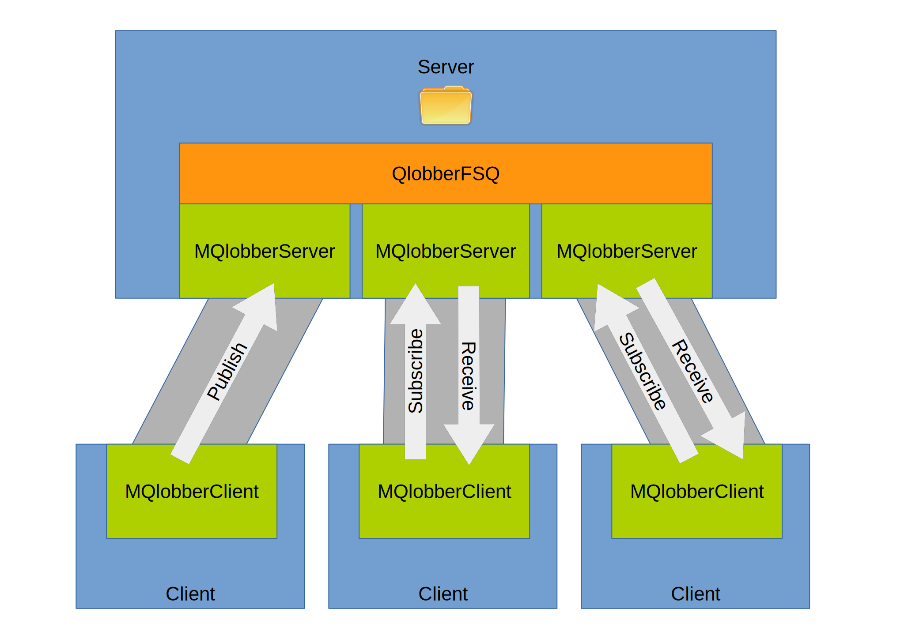

# mqlobber&nbsp;&nbsp;&nbsp;[](https://travis-ci.org/davedoesdev/mqlobber) [](https://coveralls.io/r/davedoesdev/mqlobber?branch=master) [](http://badge.fury.io/js/mqlobber)

Streaming message queue with pub-sub, work queues, wildcards and back-pressure.
Just Node and a filesystem required.

`mqlobber` basically remotes 
[`qlobber-fsq`](https://github.com/davedoesdev/qlobber-fsq) over one or more
connections.

<p align="center"></p>

Say you have a server and a number of clients, with the clients
connected to the server using some mechanism which provides a stream for each
connection. Create a `QlobberFSQ` instance on the server and for each stream,
pass the instance and the stream to `MQlobberServer`.

On each client, pass the other end of the stream to `MQlobberClient`. Clients
can then publish and subscribe to topics (including wildcard subscriptions).
Work queues are also supported - when publishing a message, a client can specify
that only one subscriber should receive it.

All data is transferred on streams multiplexed over each connection using
[`bpmux`](https://github.com/davedoesdev/bpmux), with full back-pressure support
on each stream. Clients get a `Writable` when publishing a message and a
`Readable` when receiving one.

You can scale out horizontally by creating a number of `QlobberFSQ` instances
(e.g. one per CPU core), all sharing the same message directory.

<p align="center"></p>

No other backend services are required - just Node and a filesystem.

The API is described [here](#tableofcontents).

## Example

First, let's create a server program which listens on a TCP port specified on
the command line:

```javascript
// server.js
var net = require('net'),
    QlobberFSQ = require('qlobber-fsq').QlobberFSQ,
    MQlobberServer = require('mqlobber').MQlobberServer,
    fsq = new QlobberFSQ();

fsq.on('start', function ()
{
    var server = net.createServer().listen(parseInt(process.argv[2]));
    server.on('connection', function (c)
    {
        new MQlobberServer(fsq, c);
    });
});
```

Next, a program which connects to the server and subscribes to messages
published to a topic:

```javascript
// client_subscribe.js
var assert = require('assert'),
    MQlobberClient = require('mqlobber').MQlobberClient,
    c = require('net').createConnection(parseInt(process.argv[2])),
    mq = new MQlobberClient(c),
    topic = process.argv[3];

mq.subscribe(topic, function (s, info)
{
    var msg = '';
    s.on('readable', function ()
    {
        var data;
        while ((data = this.read()) !== null)
        {
            msg += data.toString();
        }
    });
    s.on('end', function ()
    {
        console.log('received', info.topic, msg);
        assert.equal(msg, 'hello');
        c.end();
    });
});
```

Finally, a program which connects to the server and publishes a message to a
topic:

```javascript
// client_publish.js
var MQlobberClient = require('mqlobber').MQlobberClient,
    c = require('net').createConnection(parseInt(process.argv[2])),
    mq = new MQlobberClient(c);

mq.publish(process.argv[3], function ()
{
    c.end();
}).end('hello');
```

Run two servers listening on ports 8600 and 8601:

```shell
node server.js 8600 &
node server.js 8601 &
```

Subscribe to two topics, `foo.bar` and wildcard topic `foo.*`, one against each
server:

```shell
node client_subscribe.js 8600 foo.bar &
node client_subscribe.js 8601 'foo.*' &
```

Then publish a message to the topic `foo.bar`:

```shell
node client_publish.js 8600 foo.bar
```

You should see the following output, one line from each subscriber:

```
received foo.bar hello
received foo.bar hello
```

Only the servers should still be running and you can now terminate them:

```shell
$ jobs
[1]-  Running                 node server.js 8600 &
[2]+  Running                 node server.js 8601 &
$ kill %1 %2
[1]-  Terminated              node server.js 8600
[2]+  Terminated              node server.js 8601
```

## Installation

```shell
npm install mqlobber
```

## Licence

[MIT](LICENCE)

## Test

```shell
grunt test
```

## Lint

```shell
grunt lint
```

## Code Coverage

```shell
grunt converage
```

[Instanbul](http://gotwarlost.github.io/istanbul/) results are available [here](http://rawgit.davedoes.com/davedoesdev/mqlobber/master/coverage/lcov-report/index.html).

Coveralls page is [here](https://coveralls.io/r/davedoesdev/mqlobber).

#API

<a name="tableofcontents"></a>

- <a name="toc_mqlobberclientstream-options"></a>[MQlobberClient](#mqlobberclientstream-options)
- <a name="toc_mqlobberclientprototypesubscribetopic-handler-cb"></a><a name="toc_mqlobberclientprototype"></a>[MQlobberClient.prototype.subscribe](#mqlobberclientprototypesubscribetopic-handler-cb)
- <a name="toc_mqlobberclientprototypeunsubscribetopic-handler-cb"></a>[MQlobberClient.prototype.unsubscribe](#mqlobberclientprototypeunsubscribetopic-handler-cb)
- <a name="toc_mqlobberclientprototypepublishtopic-options-cb"></a>[MQlobberClient.prototype.publish](#mqlobberclientprototypepublishtopic-options-cb)
- <a name="toc_mqlobberclienteventshandshakehandshake_data"></a><a name="toc_mqlobberclientevents"></a>[MQlobberClient.events.handshake](#mqlobberclienteventshandshakehandshake_data)
- <a name="toc_mqlobberclienteventsbackoff"></a>[MQlobberClient.events.backoff](#mqlobberclienteventsbackoff)
- <a name="toc_mqlobberclienteventserrorerr-obj"></a>[MQlobberClient.events.error](#mqlobberclienteventserrorerr-obj)
- <a name="toc_mqlobberclienteventswarningerr-obj"></a>[MQlobberClient.events.warning](#mqlobberclienteventswarningerr-obj)
- <a name="toc_mqlobberserverfsq-stream-options"></a>[MQlobberServer](#mqlobberserverfsq-stream-options)
- <a name="toc_mqlobberserverprototypesubscribetopic-cb"></a><a name="toc_mqlobberserverprototype"></a>[MQlobberServer.prototype.subscribe](#mqlobberserverprototypesubscribetopic-cb)
- <a name="toc_mqlobberserverprototypeunsubscribetopic-cb"></a>[MQlobberServer.prototype.unsubscribe](#mqlobberserverprototypeunsubscribetopic-cb)
- <a name="toc_mqlobberservereventssubscribe_requestedtopic-cb"></a><a name="toc_mqlobberserverevents"></a>[MQlobberServer.events.subscribe_requested](#mqlobberservereventssubscribe_requestedtopic-cb)
- <a name="toc_mqlobberservereventshandshakehandshake_data-delay_handshake"></a>[MQlobberServer.events.handshake](#mqlobberservereventshandshakehandshake_data-delay_handshake)
- <a name="toc_mqlobberservereventsbackoff"></a>[MQlobberServer.events.backoff](#mqlobberservereventsbackoff)
- <a name="toc_mqlobberservereventserrorerr-obj"></a>[MQlobberServer.events.error](#mqlobberservereventserrorerr-obj)
- <a name="toc_mqlobberservereventswarningerr-obj"></a>[MQlobberServer.events.warning](#mqlobberservereventswarningerr-obj)

## MQlobberClient(stream, [options])

> Create a new `MQlobberClient` object for publishing and subscribing to
messages via a server.

**Parameters:**

- `{Duplex} stream` Connection to a server. The server should use [`MQlobberServer`](#mqlobberserver) on its side of the connection. How the
connection is made is up to the caller - it just has to supply a
[`stream.Duplex`](https://nodejs.org/dist/latest-v4.x/docs/api/stream.html#stream_class_stream_duplex). For example, [`net.Socket`](https://nodejs.org/dist/latest-v4.x/docs/api/net.html#net_class_net_socket) or [`PrimusDuplex`](https://github.com/davedoesdev/primus-backpressure#primusduplexmsg_stream-options).

- `{Object} [options]` Configuration options. This is passed down to [`QlobberDedup`](https://github.com/davedoesdev/qlobber#qlobberdedupoptions)
(which matches messages received from the server to handlers) and
[`BPMux`](https://github.com/davedoesdev/bpmux#bpmuxcarrrier-options)
(which multiplexes message streams over the connection to the
server). It also supports the following additional property:

  - `{Buffer} [handshake_data]` Application-specific handshake data to send to
    the server. The server-side [`MQlobberServer`](#mqlobberserver) object will
    emit this as a [`handshake`](#mqlobber_servereventshandshake) event to its
    application.

<sub>Go: [TOC](#tableofcontents)</sub>

<a name="mqlobberclientprototype"></a>

## MQlobberClient.prototype.subscribe(topic, handler, [cb])

> Subscribe to messages published to the server.

**Parameters:**

- `{String} topic` Which messages you're interested in receiving. Message topics are split into words using `.` as the separator. You can use `*` to match
exactly one word in a topic or `#` to match zero or more words. For example,
`foo.*` would match `foo.bar` whereas `foo.#` would match `foo`, `foo.bar` and
`foo.bar.wup`. Note these are the default separator and wildcard characters.
They can be changed on the server when [constructing the `QlobberFSQ` object]
(https://github.com/davedoesdev/qlobber#qlobberoptions) passed to
[`MQlobberServer`](#mqlobberserver).

- `{Function} handler` Function to call when a new message is received from the server due to its topic matching against `topic`. `handler` will be passed
the following arguments:

  - `{Readable} stream` The message content as a [Readable](http://nodejs.org/api/stream.html#stream_class_stream_readable). Note that _all_ subscribers will
    receive the same stream for each message.

  - `{Object} info` Metadata for the message, with the following properties:

    - `{String} topic` Topic to which the message was published.
    - `{Boolean} single` Whether this message is being given to _at most_ one 
      handler (across all clients connected to all servers).
    - `{Integer} expires` When the message expires (number of seconds after
      1 January 1970 00:00:00 UTC). This is only present if the server's
      [`QlobberServer`](#qlobberserver) instance is configured with
      `send_expires` set to `true`.

- `{Function} [cb]` Optional function to call once the subscription has been registered with the server. This will be passed the following argument:

  - `{Object} err` If an error occurred then details of the error, otherwise `null`'.

<sub>Go: [TOC](#tableofcontents) | [MQlobberClient.prototype](#toc_mqlobberclientprototype)</sub>

## MQlobberClient.prototype.unsubscribe([topic], [handler], [cb])

> Unsubscribe to messages published to the server.

**Parameters:**

- `{String} [topic]` Which messages you're no longer interested in receiving via the `handler` function. If topic is `undefined` then all handlers for all
topics are unsubscribed.

- `{Function} [handler]` The function you no longer want to be called with messages published to the topic `topic`. This should be a function you've
previously passed to [`subscribe`](#mqlobberprototypesubscribetopic-handler-cb).
If you subscribed `handler` to a different topic then it will still be called
for messages which match that topic. If `handler` is `undefined`, all handlers
for the topic `topic` are unsubscribed.

- `{Function]} [cb]` Optional function to call once `handler` has been unsubscribed from `topic` on the server. This will be passed the following
argument:

  - `{Object} err` If an error occurred then details of the error, otherwise `null`.

<sub>Go: [TOC](#tableofcontents) | [MQlobberClient.prototype](#toc_mqlobberclientprototype)</sub>

## MQlobberClient.prototype.publish(topic, [options], [cb])

> Publish a message to the server for interested clients to receive.

**Parameters:**

- `{String} topic` Message topic. The topic should be a series of words separated by `.` (or whatever you configured [`QlobberFSQ`](#qlobberfsqoptions)
with on the server).

- `{Object} [options]` Optional settings for this publication: 
  - `{Boolean} single` If `true` then the message will be given to _at most_
    one handler (across all clients connected to all servers). If you don't
    specify this then all interested handlers (across all clients).

  - `{Integer} ttl` Time-to-live (in seconds) for this message. If you don't
    specify this then the default is taken from the
    [`QlobberFSQ`](#qlobberfsqoptions) instance on the server. In any case,
    `QobberFSQ`'s configured time-to-live is used to constrain `ttl`'s
    maximum value.
    
- `{Function]} [cb]` Optional function to call once the server has published the message. This will be passed the following argument:

  - `{Object} err` If an error occurred then details of the error, otherwise `null`.

<sub>Go: [TOC](#tableofcontents) | [MQlobberClient.prototype](#toc_mqlobberclientprototype)</sub>

<a name="mqlobberclientevents"></a>

## MQlobberClient.events.handshake(handshake_data)

> `handshake` event

Emitted by a `MQlobberClient` object after it successfully completes an initial
handshake with its peer `MQlobberServer` object on the server.

**Parameters:**

- `{Buffer} handshake_data` Application-specific data which the `MQlobberServer` object sent along with the handshake.

<sub>Go: [TOC](#tableofcontents) | [MQlobberClient.events](#toc_mqlobberclientevents)</sub>

## MQlobberClient.events.backoff()

> `backoff` event

Emitted by a `MQlobberClient` object when it delays a request to the server
because the connection is at full capacity. If you want to avoid buffering
further requests, don't call [`subscribe`](#mqlobberclientsubscribe),
[`unsubscribe`](#mqlobberclientunsubscribe) and
[`publish`](#mqlobberclientpublish) until the connection `Duplex` emits a
[`drain`](https://nodejs.org/dist/latest-v4.x/docs/api/stream.html#stream_event_drain) event.

<sub>Go: [TOC](#tableofcontents) | [MQlobberClient.events](#toc_mqlobberclientevents)</sub>

## MQlobberClient.events.error(err, obj)

> `error` event

Emitted by a `MQlobberClient` object if an error is emitted by the multiplexing
layer ([`bpmux`](https://github.com/davedoesdev/bpmux)), preventing proper
communication with the server.

**Parameters:**

- `{Object} err` The error that occurred. 
- `{Object} obj` The object on which the error occurred.

<sub>Go: [TOC](#tableofcontents) | [MQlobberClient.events](#toc_mqlobberclientevents)</sub>

## MQlobberClient.events.warning(err, obj)

> `warning` event

Emmited by a `MQlobberClient` object when a recoverable error occurs. This will
usually be due to an error on an individual request or multiplexed stream.

Note that if there are no `warning` event listeners registered then the error
will be displayed using `console.error`.

**Parameters:**

- `{Object} err` The error that occurred. 
- `{Object} obj` The object on which the error occurred.

<sub>Go: [TOC](#tableofcontents) | [MQlobberClient.events](#toc_mqlobberclientevents)</sub>

## MQlobberServer(fsq, stream, [options])

> Create a new `MQlobberServer` object for publishing and subscribing to messages
on behalf of a client.

**Parameters:**

- `{QlobberFSQ} fsq` File system queue - an instance of [`QlobberFSQ`](https://github.com/davedoesdev/qlobber-fsq#qlobberfsqoptions).
This does the heavy-lifting of reading and writing messages to a directory on
the file system.

- `{Duplex} stream` Connection to the client. The client should use [`MQlobberClient`](#mqlobberclient) on its side of the connection. How the
connection is made is up to the caller - it just has to supply a
[`stream.Duplex`](https://nodejs.org/dist/latest-v4.x/docs/api/stream.html#stream_class_stream_duplex). For example, [`net.Socket`](https://nodejs.org/dist/latest-v4.x/docs/api/net.html#net_class_net_socket) or [`PrimusDuplex`](https://github.com/davedoesdev/primus-backpressure#primusduplexmsg_stream-options).

- `{Object} [options]` Configuration options. This is passed down to [`BPMux`](https://github.com/davedoesdev/bpmux#bpmuxcarrrier-options)
(which multiplexes message streams over the connection to the
server). It also supports the following additional property:

  - `{Boolean} send_expires` Whether to include message expiry time in metadata
    sent to clients. Defaults to `false`.

<sub>Go: [TOC](#tableofcontents)</sub>

<a name="mqlobberserverprototype"></a>

## MQlobberServer.prototype.subscribe(topic, [cb])

> Subscribe the connected client to messages.

**Parameters:**

- `{String} topic` Which messages the client should receive. Message topics are split into words using `.` as the separator. You can use `*` to match
exactly one word in a topic or `#` to match zero or more words. For example,
`foo.*` would match `foo.bar` whereas `foo.#` would match `foo`, `foo.bar` and
`foo.bar.wup`. Note these are the default separator and wildcard characters.
They can be changed when [constructing the `QlobberFSQ` instance]
(https://github.com/davedoesdev/qlobber#qlobberoptions) passed to
[`MQlobberServer`](#mqlobberserver)'s constructor.

- `{Function} [cb]` Optional function to call once the subscription has been made. This will be passed the following argument:

  - `{Object} err` If an error occurred then details of the error, otherwise `null`'.

<sub>Go: [TOC](#tableofcontents) | [MQlobberServer.prototype](#toc_mqlobberserverprototype)</sub>

## MQlobberServer.prototype.unsubscribe([topic], [cb])

> Unsubscribe the connected client from messages.

**Parameters:**

- `{String} [topic]` Which messages the client should no longer receive. If topic is `undefined` then the client will receive no more messages.

- `{Function} [cb]` Optional function to call once the subscription has been made. This will be passed the following argument:

  - `{Object} err` If an error occurred then details of the error, otherwise `null`'.

<sub>Go: [TOC](#tableofcontents) | [MQlobberServer.prototype](#toc_mqlobberserverprototype)</sub>

<a name="mqlobberserverevents"></a>

## MQlobberServer.events.subscribe_requested(topic, cb)

> `subscribe_requested` event

Emitted by a `MQlobberServer` object when it receives a request from its peer
`MQlobberClient` object to subscribe to messages published to a topic.

If there are no listeners on this event, the default action is to call
[`subscribe(topic, cb)`](#mqlobberserver_subscribe). If you add a listener on
this event, the default action will _not_ be called. This gives you the
opportunity to filter subscription requests in the application.

**Parameters:**

- `{String} topic` The topic to which the client is asking to subscribe. 
- `{Function} cb` Function to call after processing the subscription request. This function _must_ be called even if you don't call
[`subscribe`](#mqlobberserver_subscribe) yourself. It takes a single argument:

  - `{Object} err` If `null` then a success status is returned to the client
    (whether you called [`subscribe`](#mqlobberserver_subscribe) or not).
    Otherwise, the client gets a failed status and a [`warning`](#mqlobbereventswarning) event is emitted with `err`.

<sub>Go: [TOC](#tableofcontents) | [MQlobberServer.events](#toc_mqlobberserverevents)</sub>

## MQlobberServer.events.handshake(handshake_data, delay_handshake)

> `handshake` event

Emitted by a `MQlobberServer` object after it receives an initial handshake
message from its peer `MQlobberClient` object on the client.

**Parameters:**

- `{Buffer} handshake_data` Application-specific data which the `MQlobberClient` object sent along with the handshake.

- `{Function} delay_handshake` By default, `MQlobberServer` replies to `MQlobberClient`'s handshake message as soon as your event handler returns and
doesn't attach any application-specific handshake data. If you wish to delay
the handshake message or provide handshake data, call `delay_handshake`.
It returns another functon which you can call at any time to send the handshake
message. The returned function takes a single argument:

  - `{Buffer} [handshake_data]` Application-specific handshake data to send to
    the client. The client-side [`MQlobberClient`](#mqlobber_client) object will
    emit this as a [`handshake`](#mqlobber_clienteventshandshake) event to its
    application.

<sub>Go: [TOC](#tableofcontents) | [MQlobberServer.events](#toc_mqlobberserverevents)</sub>

## MQlobberServer.events.backoff()

> `backoff` event

Emitted by a `MQlobberServer` object when it delays a message to the client
because the connection is at full capacity.

If you want to avoid buffering further messages, use a `filter` function (see
[`QlobberFSQ`'s constructor](https://github.com/davedoesdev/qlobber-fsq#qlobberfsqoptions)) to prevent messages being sent until the connection `Duplex` emits a
[`drain`](https://nodejs.org/dist/latest-v4.x/docs/api/stream.html#stream_event_drain) event. In the `filter` function, a handler owned by a `MQlobberServer`
object will have a property named `mqlobber_stream` set to the connection
`Duplex`.

You can also use event listeners on [`subscribe_requested`](#mqlobberserver_eventssubscribe_requested), [`unsubscribe_requested`](#mqlobberserver_eventsunsubscribe_requested), [`unsubscribe_all_requested`](#mqlobberserver_eventsunsubscribe_all_requested) and [`publish_requested`](#mqlobberserver_publish_requested) to prevent responses being
sent to the client until the connection emits a `drain` event.

Depending on your application, you might also terminate the connection if it
can't keep up.

<sub>Go: [TOC](#tableofcontents) | [MQlobberServer.events](#toc_mqlobberserverevents)</sub>

## MQlobberServer.events.error(err, obj)

> `error` event

Emitted by a `MQlobberServer` object if an error is emitted by the multiplexing
layer ([`bpmux`](https://github.com/davedoesdev/bpmux)), preventing proper
communication with the client.

**Parameters:**

- `{Object} err` The error that occurred. 
- `{Object} obj` The object on which the error occurred.

<sub>Go: [TOC](#tableofcontents) | [MQlobberServer.events](#toc_mqlobberserverevents)</sub>

## MQlobberServer.events.warning(err, obj)

> `warning` event

Emmited by a `MQlobberServer` object when a recoverable error occurs. This will
usually be due to an error on an individual request or multiplexed stream.

Note that if there are no `warning` event listeners registered then the error
will be displayed using `console.error`.

**Parameters:**

- `{Object} err` The error that occurred. 
- `{Object} obj` The object on which the error occurred.

<sub>Go: [TOC](#tableofcontents) | [MQlobberServer.events](#toc_mqlobberserverevents)</sub>

_&mdash;generated by [apidox](https://github.com/codeactual/apidox)&mdash;_
